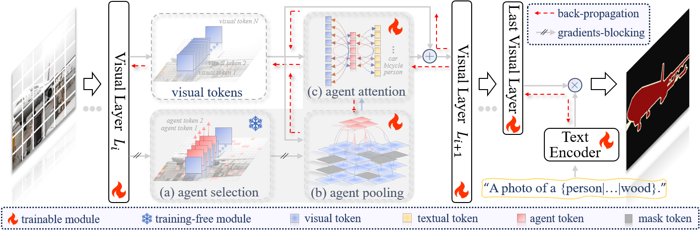

# Novel Category Discovery with X-Agent Attention for Open-Vocabulary Semantic Segmentation

Authors: Jiahao Li, Yang Lu, Yachao Zhang, Fangyong Wang, Yuan Xie*, Yanyun Qu*.     *Corresponding author

[[paper]()] 

> **Abstract: Open-vocabulary semantic segmentation (OVSS) conducts pixel-level classification via text-driven alignment, where the domain discrepancy between base category training and open-vocabulary inference poses challenges in discriminative modeling of latent unseen category. To address this challenge, existing vision-language model (VLM)-based approaches demonstrate commendable performance through pre-trained multi-modal representations. However, the fundamental mechanisms of latent semantic comprehension remain underexplored, making the bottleneck for OVSS. In this work, we initiate a probing experiment to explore distribution patterns and dynamics of latent semantics in VLMs under inductive learning paradigms. Building on these insights, we propose X-Agent, an innovative OVSS framework employing latent semantic-aware ``agent'' to orchestrate cross-modal attention mechanisms, simultaneously optimizing latent semantic dynamic and amplifying its perceptibility. Extensive benchmark evaluations demonstrate that X-Agent achieves state-of-the-art performance while effectively enhancing the latent semantic saliency.** 
>
> <p align="center">
> 
> </p>

## News
* **2025-07** :loudspeaker: Our work, [X-Agent](), has been accepted by ACMMMM 2025.
* **2025-03** :rocket: We release the code for X-Agent.

## :fire:TODO
- [x] Train/Evaluation Code

## Installation
Please follow [installation](INSTALL.md). 

## Data Preparation
Please follow [dataset preperation](datasets/README.md).

## Training
We provide shell scripts for training and evaluation. ```run.sh``` trains the model in default configuration and evaluates the model after training. 

To train or evaluate the model in different environments, modify the given shell script and config files accordingly.

### Training script
```bash
sh run.sh [CONFIG] [NUM_GPUS] [OUTPUT_DIR] [OPTS]

# For ViT-B variant
sh run.sh configs/vitb_384.yaml 4 output/
# For ViT-L variant
sh run.sh configs/vitl_336.yaml 4 output/
```

## Evaluation
```eval.sh``` automatically evaluates the model following our evaluation protocol, with weights in the output directory if not specified.
To individually run the model in different datasets, please refer to the commands in ```eval.sh```.

### Evaluation script
```bash
sh run.sh [CONFIG] [NUM_GPUS] [OUTPUT_DIR] [OPTS]

sh eval.sh configs/vitl_336.yaml 4 output/ MODEL.WEIGHTS path/to/weights.pth
```
